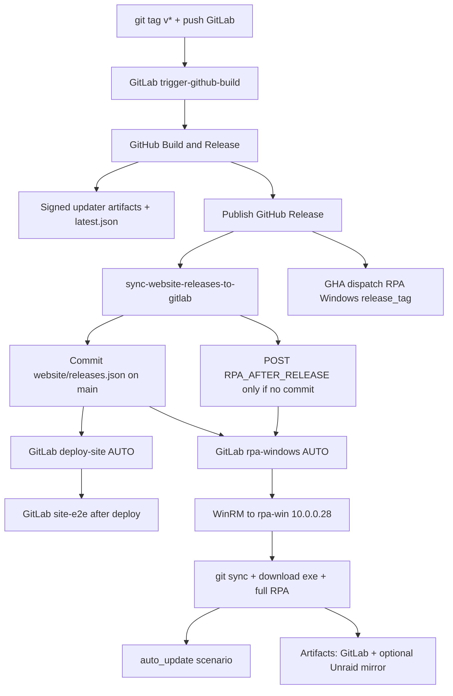

# Release → site → RPA pipeline

End-to-end automation for Void Browser after a `v*` tag.



## GitLab stage order

`lint → security-app → trigger → sync → deploy → security-site → e2e → scan → rpa → notify`

`site-e2e` is in **e2e** (after **deploy** and **security-site**). It must not use `needs: []` — that raced the live `:5080` origin before `deploy-site` finished.

`security-app` / `security-site` are **defensive** checks only (dependency audit, static greps, config/header hardening). They do not generate exploits. See [SECURITY.md](./SECURITY.md).

## Auto vs manual (Play)

| Job | Stage | When it runs |
|-----|-------|----------------|
| `rustfmt` / `clippy` | lint | **Auto** on `main` + MRs |
| `cargo-audit` / `license-check` | security-app | **Auto** on `main` + tags |
| `app-security` | security-app | **Auto** on `main` + MRs + tags |
| `trigger-github-build` | trigger | **Auto** on `v*` tags (`needs: []` so it fires ASAP) |
| `sync-releases-from-github` | sync | **Auto** on schedule / API `SYNC_RELEASES=1`; **Manual** on `main` |
| `deploy-site` | deploy | **Auto** on `main` when `website/**` changes; **Manual** otherwise |
| `site-security` | security-site | **Auto** on `main` + MRs (after deploy stage; live header probe is soft unless `SITE_SECURITY_LIVE=1`) |
| `site-e2e` | e2e | **Auto** on every `main` push (after auto deploy when that job ran) |
| `virus-scan` | scan | **Manual** only (main + tags) — binary/package VT; do not automate |
| `rpa-windows` | rpa | **Auto** on `RPA_AFTER_RELEASE=1` or `website/releases.json` change; **Manual** otherwise |
| `sync-rpa-win-repo` | notify | **Auto** on every `main` push |

`RPA_AFTER_RELEASE=1` pipelines skip everything except `rpa-windows`.

## What runs automatically (release path)

| Step | How |
|------|-----|
| Multi-platform build + signed updater | GitHub `Build & Release` on `v*` (via `trigger-github-build`) when `TAURI_SIGNING_PRIVATE_KEY` is on env `release` |
| `latest.json` on GitHub Releases | Release job `generate-updater-manifest.sh` |
| Website `releases.json` | `scripts/sync-website-releases-to-gitlab.sh` commits to GitLab `main` |
| Site deploy | `deploy-site` on `website/**` changes |
| Site E2E | `site-e2e` after deploy stage (live `:5080`) |
| RPA on rpa-win (incl. `auto_update`) | Push with `website/releases.json` changes, **or** API `RPA_AFTER_RELEASE=1` if already up to date |
| GHA hosted RPA smoke | Build & Release dispatches `.github/workflows/rpa-windows.yml` with `release_tag` (needs `GH_WORKFLOW_TOKEN` on env `release`) |
| rpa-win repo refresh | `sync-rpa-win-repo` on each `main` push |

## Runner notes

GitLab Unraid runners process about one job at a time. API pipelines with `RPA_AFTER_RELEASE=1` can be auto-canceled if a newer `main` push arrives while queued — that is why a successful `website/releases.json` commit is preferred (same pipeline as deploy-site).

## Still manual / ops

| Item | Why |
|------|-----|
| `VOID_RPA_WIN_PASS` | Set in GitLab CI (short passwords cannot be masked — rotate to 8+ chars) |
| VirusTotal scan | Still manual play (`virus-scan`) — do **not** automate |
| `sync-releases-from-github` on main | Fallback Play if GHA sync missed; schedule/API are auto |
| `deploy-site` without `website/**` | Optional redeploy Play |
| Runner queue | RPA waits behind lint/clippy when the shared runner is busy |
| Local WinRM TrustedHosts | One-time for `rpa-remote-run.ps1` on DANIELRIG |

**Not manual anymore:** interactive desktop on rpa-win. Winlogon Autologon for `rpa-win` lands an Active console after reboot; QEMU VNC may listen but a human viewer is not required. See [TEST_VMS.md](./TEST_VMS.md).

## Manual test (no new tag)

```bash
# GitLab → CI/CD → Pipelines → Run pipeline → Variables:
#   RPA_AFTER_RELEASE = 1
#   RELEASE_TAG = v0.1.0-alpha.16
```

Or play the `rpa-windows` manual job on a `main` pipeline.

See also: [RPA_TESTING.md](./RPA_TESTING.md), [UPDATE.md](./UPDATE.md).
