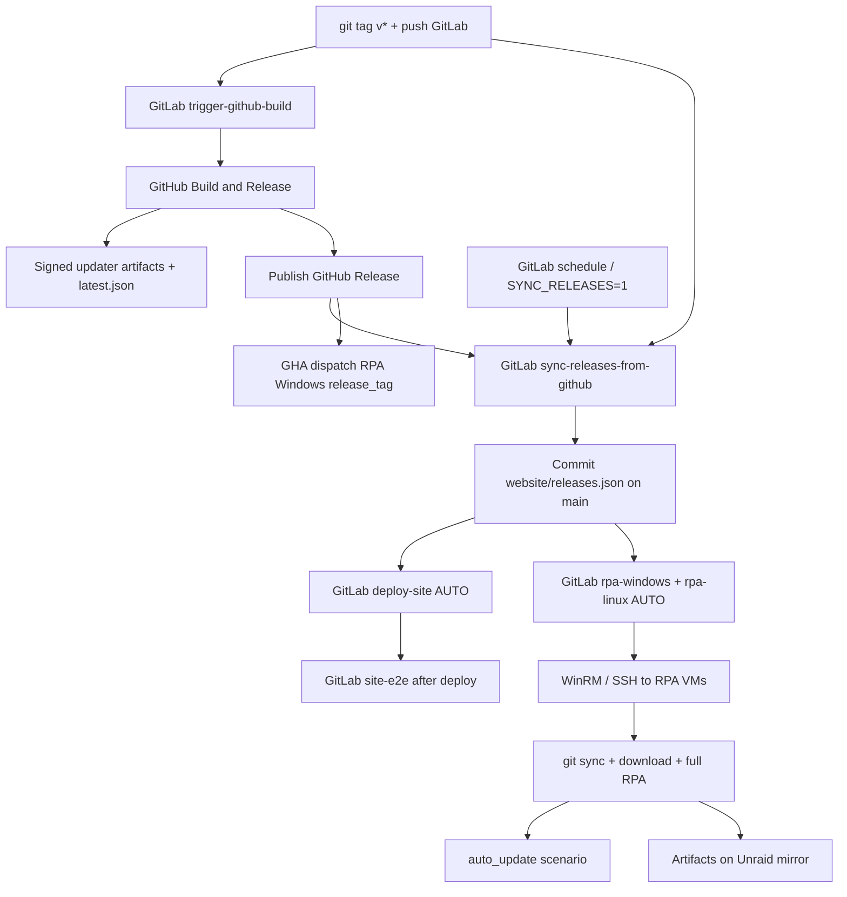

# Release → site → RPA pipeline

End-to-end automation for Void Browser after a `v*` tag.



## GitLab owns `website/releases.json`

GitHub Actions **cannot** reach LAN GitLab (`10.0.0.10`). The Build & Release
workflow no longer attempts a GHA→GitLab commit (that step is a documented no-op).

**Sole sync path:** GitLab job `sync-releases-from-github` on the Unraid runner:

| Trigger | Behavior |
|---------|----------|
| `v*` tag pipeline | Polls GitHub API until installer assets exist (up to ~90 min), commits to **main** |
| Schedule | Polls newest published release; commits if `website/releases.json` differs |
| Run pipeline / API with `SYNC_RELEASES=1` | Same as schedule (optional `RELEASE_TAG=v…`) |

Script: `scripts/sync-website-releases-from-github.sh`. A successful commit pushes
`main`, which auto-runs `deploy-site` + `rpa-*` via `changes:` rules.

**Ops:** add a GitLab schedule (CI/CD → Schedules) on `main`, e.g. every 30–60 min,
so a slow GHA release is still picked up if the tag-poll job times out
(`allow_failure: true`). Optional project var `GH_WORKFLOW_TOKEN` / `GITHUB_TOKEN`
raises GitHub API rate limits for the poll.

`scripts/sync-website-releases-to-gitlab.sh` remains for rare local/ops use only —
not called from GHA.

## GitLab stage order

`lint → security-app → trigger → sync → deploy → security-site → e2e → scan → rpa → notify`

`site-e2e` is in **e2e** (after **deploy** and **security-site**). It must not use `needs: []` — that raced the live `:5080` origin before `deploy-site` finished.

`security-app` / `security-site` are **defensive** checks only (dependency audit, static greps, config/header hardening). They do not generate exploits. See [SECURITY.md](./SECURITY.md).

## Auto vs optional (no always-on Play stubs)

Optional jobs are **omitted** from the pipeline unless their rules match. There are
no `when: manual` Play buttons for `deploy-site` / `rpa-*` / `sync-releases` on
every main push.

| Job | Stage | When it is created |
|-----|-------|--------------------|
| `rustfmt` / `clippy` | lint | **Auto** on `main` + MRs |
| `cargo-audit` / `license-check` | security-app | **Auto** on `main` + tags |
| `app-security` | security-app | **Auto** on `main` + MRs + tags |
| `trigger-github-build` | trigger | **Auto** on `v*` tags (`needs: []` so it fires ASAP) |
| `sync-releases-from-github` | sync | **Auto** on schedule, `v*` tags, or `SYNC_RELEASES=1` |
| `deploy-site` | deploy | **Auto** when `website/**` changes; or `DEPLOY_SITE=1` |
| `site-security` | security-site | **Auto** on `main` + MRs |
| `site-e2e` | e2e | **Auto** on every `main` push |
| `virus-scan` | scan | **Manual Play** only on `v*` tags, `website/releases.json` changes, or `VIRUS_SCAN=1` (never auto) |
| `rpa-windows` / `rpa-linux` | rpa | **Auto** on `RPA_AFTER_RELEASE=1` or `website/releases.json` change; or `RUN_RPA=1` / `RUN_RPA_WINDOWS=1` / `RUN_RPA_LINUX=1` |
| `sync-rpa-*-repo` | sync | **Auto** on every `main` push (skipped when `RPA_AFTER_RELEASE=1`) |

`RPA_AFTER_RELEASE=1` pipelines skip everything except `rpa-windows` + `rpa-linux`.

## What runs automatically (release path)

| Step | How |
|------|-----|
| Multi-platform build + signed updater | GitHub `Build & Release` on `v*` (via `trigger-github-build`) when `TAURI_SIGNING_PRIVATE_KEY` is on env `release` |
| `latest.json` on GitHub Releases | Release job `generate-updater-manifest.sh` |
| Website `releases.json` | **GitLab** `sync-releases-from-github` (tag poll and/or schedule) |
| Site deploy | `deploy-site` on `website/**` changes |
| Site E2E | `site-e2e` after deploy stage (live `:5080`) |
| RPA on rpa-win / rpa-linux | Push with `website/releases.json` changes, **or** API `RPA_AFTER_RELEASE=1` |
| GHA hosted RPA smoke | Build & Release dispatches `.github/workflows/rpa-windows.yml` with `release_tag` (needs `GH_WORKFLOW_TOKEN` on env `release`) |
| RPA VM repo refresh | `sync-rpa-*-repo` on each `main` push |

## Runner notes

GitLab Unraid runners process about one job at a time. Tag-pipeline
`sync-releases-from-github` may poll for up to ~90 minutes waiting on GHA assets —
prefer a **schedule** as the durable backstop so a busy runner is not blocked
forever if the tag job is skipped/failed. A successful `website/releases.json`
commit is preferred over a bare `RPA_AFTER_RELEASE=1` API pipeline (auto-cancel
on newer main pushes can kill queued RPA).

## Still manual / ops

| Item | Why |
|------|-----|
| `VOID_RPA_WIN_PASS` / `VOID_RPA_LINUX_PASS` | Set in GitLab CI (short passwords cannot be masked — rotate to 8+ chars) |
| VirusTotal scan | Manual Play (`virus-scan`) on tags / releases.json / `VIRUS_SCAN=1` — do **not** automate |
| Redeploy without website diff | Run pipeline with `DEPLOY_SITE=1` |
| Ad-hoc RPA without release | Run pipeline with `RUN_RPA=1` (or `RUN_RPA_WINDOWS` / `RUN_RPA_LINUX`) |
| Force releases sync now | Run pipeline with `SYNC_RELEASES=1` (optional `RELEASE_TAG`) |
| Runner queue | RPA waits behind lint/clippy when the shared runner is busy |
| Local WinRM TrustedHosts | One-time for `rpa-remote-run.ps1` on DANIELRIG |

**Not manual anymore:** interactive desktop on rpa-win. Winlogon Autologon for `rpa-win` lands an Active console after reboot; QEMU VNC may listen but a human viewer is not required. See [TEST_VMS.md](./TEST_VMS.md).

## Manual test (no new tag)

```bash
# GitLab → CI/CD → Pipelines → Run pipeline → Variables:
#   RPA_AFTER_RELEASE = 1
#   RELEASE_TAG = v0.1.0-alpha.16
#
# Or without skipping other jobs:
#   RUN_RPA = 1
#   RELEASE_TAG = v0.1.0-alpha.16
#
# Force website sync:
#   SYNC_RELEASES = 1
```

See also: [RPA_TESTING.md](./RPA_TESTING.md), [UPDATE.md](./UPDATE.md).
