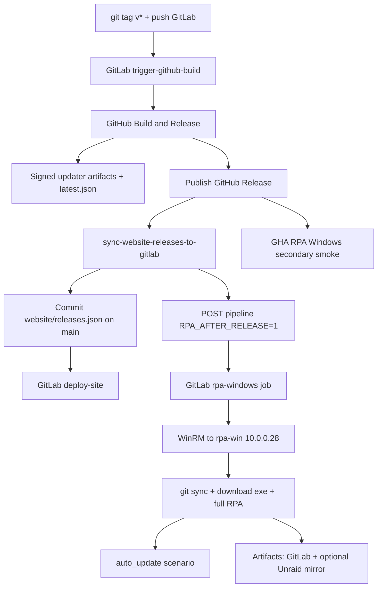

# Release → site → RPA pipeline

End-to-end automation for Void Browser after a `v*` tag.



## What runs automatically

| Step | How |
|------|-----|
| Multi-platform build + signed updater | GitHub `Build & Release` on `v*` (via `trigger-github-build`) when `TAURI_SIGNING_PRIVATE_KEY` is on env `release` |
| `latest.json` on GitHub Releases | Release job `generate-updater-manifest.sh` |
| Website `releases.json` | `scripts/sync-website-releases-to-gitlab.sh` commits to GitLab `main` |
| Site deploy | `deploy-site` on `website/**` changes |
| RPA on rpa-win (incl. `auto_update`) | Sync script POSTs GitLab pipeline `RPA_AFTER_RELEASE=1` → job `rpa-windows` → `scripts/ci/rpa-winrm.py` |
| GHA hosted RPA smoke | `.github/workflows/rpa-windows.yml` on `release: published` |
| rpa-win repo refresh | `sync-rpa-win-repo` on each `main` push |

## Still manual / ops

| Item | Why |
|------|-----|
| Interactive desktop on rpa-win | Log in once via VNC after reboot (`http://10.0.0.10:5702/`) — UIA needs Active session |
| `VOID_RPA_WIN_PASS` CI variable | Must exist in GitLab (masked); never commit |
| VirusTotal scan | Still manual play (`virus-scan`) unless key + auto rules added later |
| First-time TrustedHosts / WinRM on clients | One-time LAN setup |

## Manual test (no new tag)

```bash
# GitLab → CI/CD → Pipelines → Run pipeline → Variables:
#   RPA_AFTER_RELEASE = 1
#   RELEASE_TAG = v0.1.0-alpha.16
```

Or play the `rpa-windows` manual job on a `main` pipeline.

See also: [RPA_TESTING.md](./RPA_TESTING.md), [UPDATE.md](./UPDATE.md).
