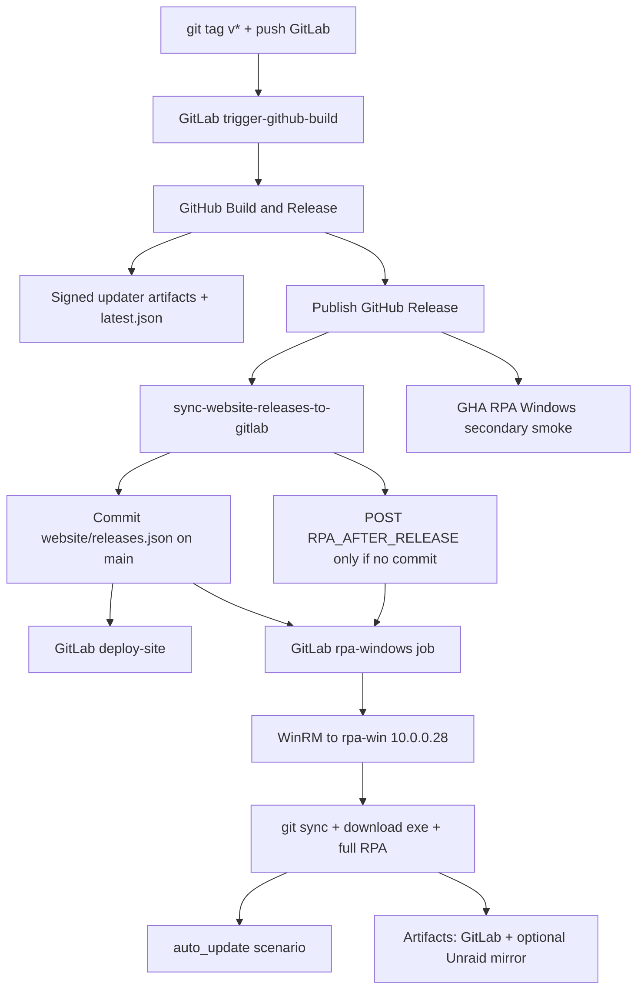

# Release → site → RPA pipeline

End-to-end automation for Void Browser after a `v*` tag.



## What runs automatically

| Step | How |
|------|-----|
| Multi-platform build + signed updater | GitHub `Build & Release` on `v*` (via `trigger-github-build`) when `TAURI_SIGNING_PRIVATE_KEY` is on env `release` |
| `latest.json` on GitHub Releases | Release job `generate-updater-manifest.sh` |
| Website `releases.json` | `scripts/sync-website-releases-to-gitlab.sh` commits to GitLab `main` |
| Site deploy | `deploy-site` on `website/**` changes |
| RPA on rpa-win (incl. `auto_update`) | Push with `website/releases.json` changes, **or** API `RPA_AFTER_RELEASE=1` if already up to date |
| GHA hosted RPA smoke | `.github/workflows/rpa-windows.yml` on `release: published` |
| rpa-win repo refresh | `sync-rpa-win-repo` on each `main` push |

## Runner notes

GitLab Unraid runners process about one job at a time. API pipelines with `RPA_AFTER_RELEASE=1` can be auto-canceled if a newer `main` push arrives while queued — that is why a successful `website/releases.json` commit is preferred (same pipeline as deploy-site).

## Still manual / ops

| Item | Why |
|------|-----|
| `VOID_RPA_WIN_PASS` | Set in GitLab CI (short passwords cannot be masked — rotate to 8+ chars) |
| VirusTotal scan | Still manual play (`virus-scan`) — do **not** automate |
| Runner queue | RPA waits behind lint/clippy when the shared runner is busy |
| Local WinRM TrustedHosts | One-time for `rpa-remote-run.ps1` on DANIELRIG |

**Not manual anymore:** interactive desktop on rpa-win. Winlogon Autologon for `rpa-win` lands an Active console after reboot; QEMU VNC may listen but a human viewer is not required. See [TEST_VMS.md](./TEST_VMS.md).

## Manual test (no new tag)

```bash
# GitLab → CI/CD → Pipelines → Run pipeline → Variables:
#   RPA_AFTER_RELEASE = 1
#   RELEASE_TAG = v0.1.0-alpha.16
```

Or play the `rpa-windows` manual job on a `main` pipeline.

See also: [RPA_TESTING.md](./RPA_TESTING.md), [UPDATE.md](./UPDATE.md).
